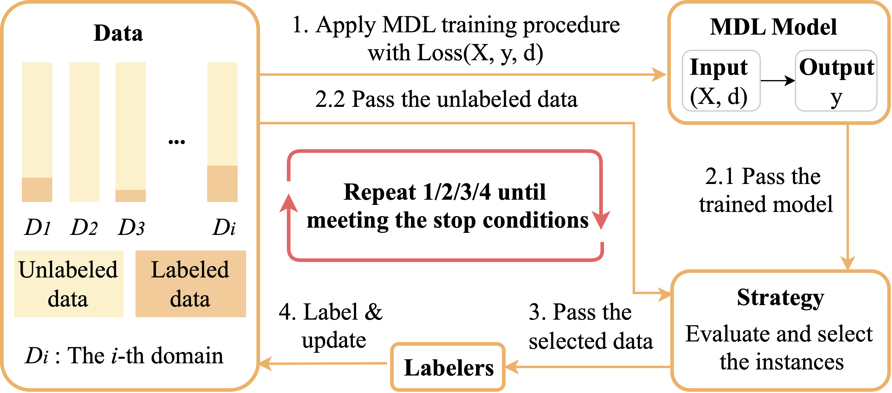

# MDAL Pipeline

This code is for [*Multi-Domain Active Learning: Literature Review and Comparative Study*](https://arxiv.org/abs/2106.13516)

## Environment
- Python 3.8
- Pytorch 1.7.1

## Pipeline

## Implemented Models and Strategies

### Models

- SDL_seperate
- SDL_joint
- DANN
- MDNet
- MAN
- CAN

### Strategies

- Random
- BvSB
- EGL
- BADGE
- Coreset
